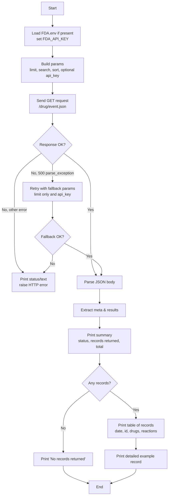

## Overview

This script (`FDA_good_query.python.py`) sends a **filtered query** to the **openFDA Drug Event API (FAERS – FDA Adverse Event Reporting System)**, then prints:

- A compact **query summary** (HTTP status, records returned, total matches).
- A **table view** with one line per adverse-event report.
- A detailed **example record** showing key patient, drug, and reaction fields.

It is designed as a **“good API query” example**: it documents the endpoint, handles errors gracefully, and summarizes the returned data in a human-readable format.

---

## API endpoint and parameters

- **Base URL:** `https://api.fda.gov/drug/event.json`
- **HTTP method:** `GET`

### Core parameters

- **`limit`**  
  - Controls how many records to return (per request).  
  - In this script: `limit = 15`.

- **`search`**  
  - Filters records by **received date range**.  
  - In this script:  
    - `receivedate:[20230101 TO 20241231]`  
    - Returns reports where FDA received the report between **2023-01-01** and **2024-12-31**.

- **`sort`**  
  - Sorts results by a given field.  
  - In this script: `sort = receivedate:desc` (most recent first).

- **`api_key`** (optional but recommended)  
  - Increases your rate limits.  
  - Loaded from the environment variable **`FDA_API_KEY`**, typically via an `FDA.env` file.

### Fallback behavior

Some versions of the API can return a `500` parse error for date-range searches (especially if `+TO+` is used). The script:

1. Tries the full query with `search` and `sort`.
2. If it gets a **500 parse_exception**, it **retries** with a simpler query:
   - Only `limit = 15` (and `api_key` if available).

---

## Data structure

The openFDA Drug Event API returns JSON with two main top-level keys:

- **`meta`**  
  - `meta.disclaimer`  
  - `meta.terms`  
  - `meta.license`  
  - `meta.last_updated`  
  - `meta.results` (object with pagination info):
    - `skip`: how many records were skipped.
    - `limit`: how many records are returned in this response.
    - `total`: total number of matching records in the database.

- **`results`** (list)  
  - Each item is **one adverse-event report**, with fields such as:
    - `receivedate`: when FDA received the report (YYYYMMDD).
    - `safetyreportid` / `report_num`: the report identifier.
    - `patient`: nested info (may include `patientsex`, `patientonsetage`, etc.).
    - `drug` / `patient.drug`: list of involved products:
      - `medicinalproduct`, `brand_name`, and other drug attributes.
    - `reaction` / `patient.reaction`: list of reactions:
      - `reactionmeddrapt` (e.g., specific reaction term).

The script:

- Reads and stores `meta.results.total`, `meta.results.limit`, and `len(results)` for summary.
- Builds **compact strings** of drug names and reactions for each row, using helper functions:
  - `_drug_names(record, max_len=40)`
  - `_reaction_names(record, max_len=35)`

---

## Flow (Mermaid diagram)



---

## Usage instructions

### 1. Install dependencies

From the root of the repo (or inside `01_query_api`), ensure you have:

- **Python 3.9+** (or similar)
- Packages:

```bash
pip install requests python-dotenv
```

### 2. (Optional but recommended) Create `FDA.env`

In the project root or inside `01_query_api`, create a file named `FDA.env`:

```bash
FDA_API_KEY=YOUR_OPENFDA_API_KEY_HERE
```

The script will:

- Look for `FDA.env` in the current directory.
- If not found, look one level up (`../FDA.env`).

If no file is found and `FDA_API_KEY` is not set, the script prints a warning but can still run at lower rate limits.

### 3. Run the script

From within the `01_query_api` directory:

```bash
python FDA_good_query.python.py
```

You should see:

- A **query summary** line with HTTP status, records returned, and total matches.
- A **table** with one row per record.
- A **detailed example record** showing key patient, drug, and reaction fields.

If the API returns no records (for example, if the filter is too strict or the API behavior changes), the script prints a clear message instead of failing silently.

