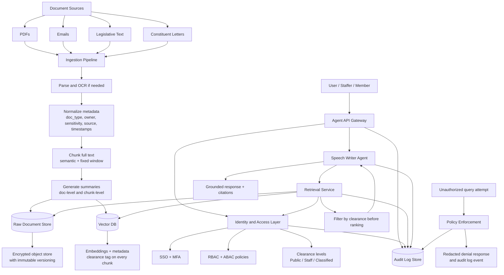

# Speech Writer Agent System Architecture

## Design Answers

### 1) How are documents ingested and chunked?
- Ingest all required source types: PDFs, emails, legislative text, and constituent letters.
- Store both **full text** and **summaries**:
  - Full text for legal/factual fidelity and citation.
  - Summaries for faster retrieval and lower token cost.
- Chunking strategy:
  - First pass: semantic section-aware chunking (headings, sections, paragraphs).
  - Second pass: fixed-size window with overlap to preserve context continuity.
- Attach metadata to each chunk: `doc_id`, `chunk_id`, `doc_type`, `source`, `owner`, `created_at`, `classification`, and `handling_caveats`.

### 2) How is access control enforced?
- Enforce access at multiple layers (defense in depth):
  - Identity: SSO + MFA.
  - Authorization: RBAC (role) + ABAC (attributes like committee, office, clearance, need-to-know).
  - Data layer: Row Level Security (RLS) and policy-filtered retrieval in SQL/vector queries.
- API keys can map to tiered service levels, but **must not** be the primary clearance mechanism.
- Every query is policy-checked before retrieval and again before response assembly.

### 3) What database stores vectors vs. raw documents?
- **Raw documents:** encrypted object store (for example S3-compatible bucket) plus relational metadata catalog.
- **Vectors:** Postgres + `pgvector` (or equivalent vector engine) with chunk-level metadata and classification tags.
- Keep a strong foreign-key relationship: vector chunks reference canonical raw document IDs.

### 4) Does the agent see raw documents, chunks, or summaries?
- Default agent context should use **retrieved chunks + chunk summaries**.
- Raw documents are fetched only when:
  - A user has sufficient clearance, and
  - The agent needs precise quotation/verification beyond chunk context.
- This minimizes overexposure while preserving accuracy.

### 5) What happens when a user queries above clearance level?
- The retrieval service returns no restricted chunks to the agent.
- The user receives a safe response, for example:
  - “I can’t provide that information at your current access level.”
  - Optionally include guidance on how to request authorized access.
- System writes an auditable event with user ID, query hash, policy rule triggered, and timestamp.
- Never reveal document existence details beyond the user’s clearance.

## Recommended Response Policy for the Agent
- Always cite retrieved sources visible to the requester.
- If evidence is missing at current clearance, return:
  - “Insufficient authorized evidence for a verified answer.”
- Never hallucinate restricted content; never infer classified details from public context.
